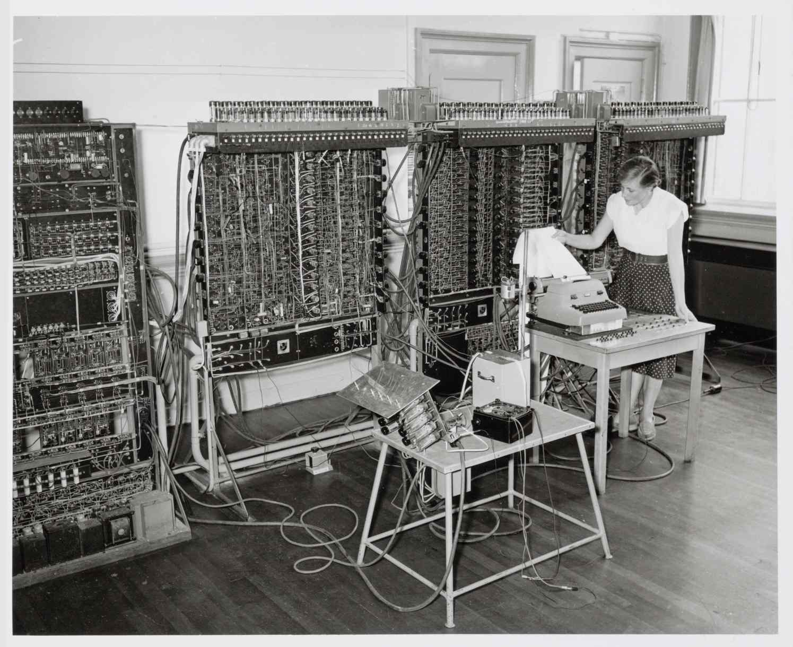

# Catalogue of Archival Resilience

[Assignments](IMD/Assignments.csv)

- How does the the medium open up another avenue through transcoding?
- Representation of the sculpture / replica?

[Negative (photography)](https://en.wikipedia.org/wiki/Negative_(photography))

[Photographic paper](https://en.wikipedia.org/wiki/Photographic_paper)

[Photographic printing](https://en.wikipedia.org/wiki/Photographic_printing)

[Photographic processing](https://en.wikipedia.org/wiki/Photographic_processing)

[Transcoding ideas](IMD/Transcoding%20ideas.csv)

# Thoughts coming through the research

- The scene was not repeated after the computing girls got married.
- The very temporary moment was captured through a lens.
- After being photographed, developed, printed, the photo came to me to be available to laser print through so many different process with different materials.
    1. The physical photography was collected from IISG
    2. It was scanned.
    3. Converted as a digital file. (JPEG)
    4. Uploaded online on web.
    5. I physically went to the archive.
    6. I downloaded the high-res file.
    7. I printed the file by myself and there were several decisions involved:
        1. What kind of paper/how heavy?
        2. What kind of printer?
        3. How big?
        4. Cut or no cut?
        5. How many prints?
        6. Through what kind of software?
- Me, as a woman who's interested in computers, transcode it with a computational method
- Recreating the situation itself — this computational activity I do as an activistic gesture.

# The Golden Record

Pioneers 10 and 11, which preceded Voyager, both carried small metal plaques identifying their time and place of origin for the benefit of any other spacefarers that might find them in the distant future. With this example before them, NASA placed a more ambitious message aboard Voyager 1 and 2, a kind of time capsule, intended to communicate a story of our world to extraterrestrials. The Voyager message is carried by a phonograph record, a 12-inch gold-plated copper disk containing sounds and images selected to portray the diversity of life and culture on Earth.

[Printing method](IMD/Printing%20method.md)

[Image Compression and process](IMD/Image%20Compression%20and%20process.md)